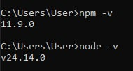
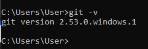
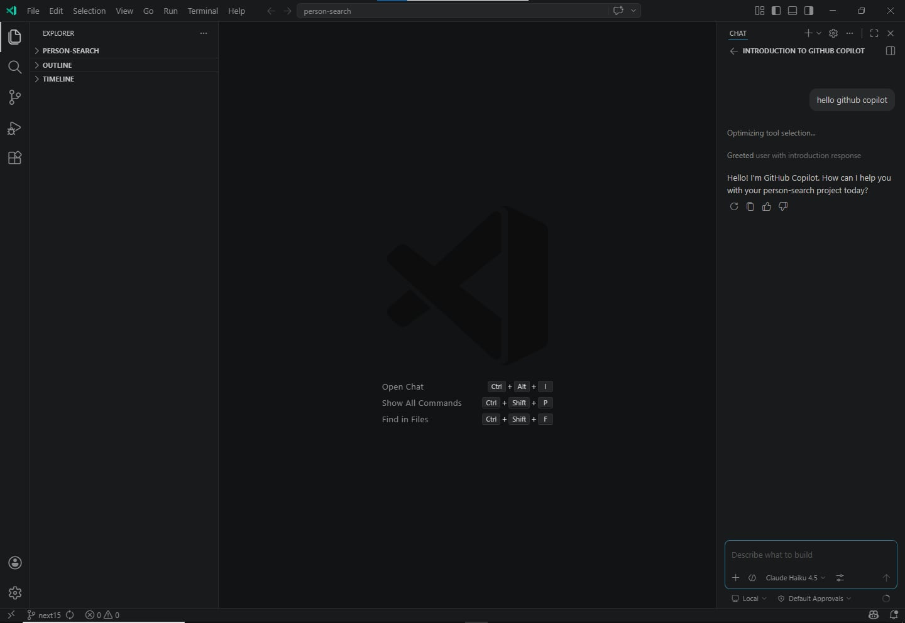
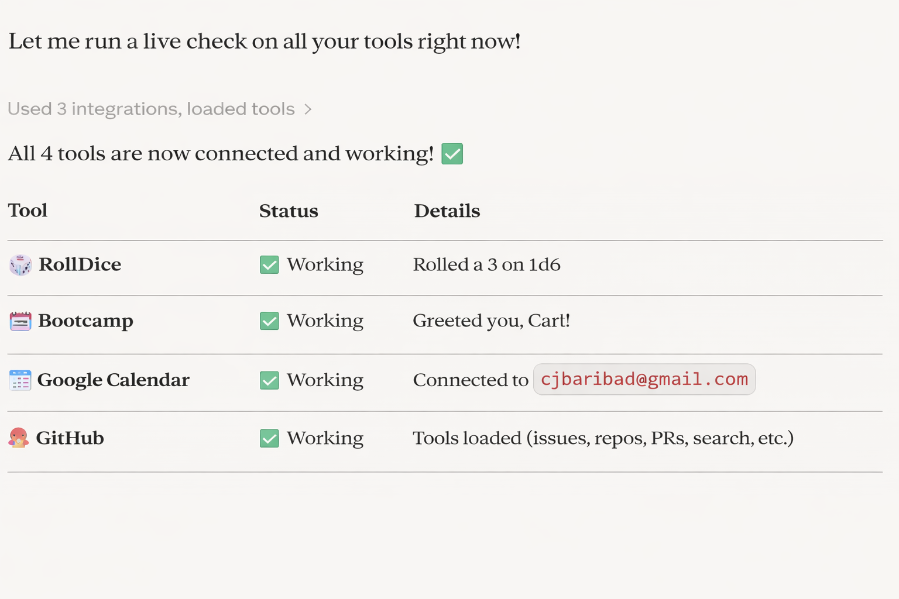

AI Agent Developer Environment Setup

Name: Carl Justine B. Baribad
Workshop Cohort: AI Agent Developer Bootcamp 2026

---

Development Environment Checklist

✅Node.js Installed


Steps taken:
- Downloaded Node.js LTS from https://nodejs.org
- Verified installation with `node --version` and `npm --version`

---

✅ Git Installed


Steps taken:
- Installed Git from https://git-scm.com
- Configured global user: `git config --global user.name` and `git config --global user.email`

---

✅ VS Code Insiders Running with GitHub Copilot Enabled


Steps taken:
- Downloaded VS Code Insiders from https://code.visualstudio.com/insiders/
- Installed GitHub Copilot extension from the Extensions marketplace
- Signed in with GitHub account to activate Copilot

---

✅ Claude Desktop Open with All 4 MCP Servers Connected


Steps taken:
- Configured `claude-desktop-config.json` with all 4 MCP server entries (see `/mcp-configs/`)
- Restarted Claude Desktop after each configuration change

---

🔌 MCP Server Descriptions

1. 🎲 Rolldice
Purpose: A simple dice-rolling MCP server used as a foundational learning tool.

Functionality:
- Rolls dice using standard tabletop notation (e.g., `2d6`, `1d20`, `4d8+3`)
- Demonstrates the basic MCP request/response pattern
- Ideal for verifying that your MCP infrastructure is working before connecting more complex servers
- Teaches the core concept: Claude can call external tools and receive structured data back

Why it matters: Rolldice is the "Hello World" of MCP servers. Its simplicity makes it perfect for diagnosing connection issues without the noise of authentication or complex data schemas.

---

2. 🧠 Bootcamp AI Agent
Purpose: A workshop-specific MCP server providing bootcamp utilities and learning tools.

Functionality:
- Exposes bootcamp-specific tools: task management (`todo_add`, `todo_list`, `todo_complete`, `todo_delete`), math operations (`calculate`), and fun utilities (`tell_joke`, `greet`, `random_number`)
- Acts as a practice ground for understanding how custom business logic is exposed via MCP
- Simulates what a real internal company tool integration would look like

Why it matters: This server bridges the gap between "toy examples" and real-world AI agent tooling. Managing todos via Claude is a microcosm of enterprise workflow automation.

---

3. 📅 Calendar Booking (Google Calendar)
Purpose: Connects Claude directly to Google Calendar for intelligent scheduling and event management.

Functionality:
- Lists, creates, updates, and deletes calendar events
- Finds free time slots across multiple calendars
- Responds to meeting invitations
- Enables natural language scheduling: "Book a 1-hour meeting with the team next Tuesday afternoon"

Why it matters: Calendar integration demonstrates the real power of AI agents Claude doesn't just suggest a meeting time, it books it. This is the transition from AI as advisor to AI as executor.

---

4. 🐙 GitHub MCP
Purpose: Gives Claude direct read/write access to GitHub repositories and workflows.

Functionality:
- Creates, reads, and updates files in repositories
- Opens and manages issues and pull requests
- Searches code across repositories
- Interacts with GitHub Actions, branches, and commits

Why it matters: The GitHub MCP server closes the loop on AI-assisted development. Claude can not only write code but also commit it, open PRs, and manage the entire software delivery workflow making it a true development co-pilot.

---

🛠️ Troubleshooting Notes

Issue 1: MCP server not appearing in Claude Desktop
Problem: After editing `claude-desktop-config.json`, the server didn't show up.
Solution: Claude Desktop must be fully quit (not just closed) and relaunched. On macOS, right-click the dock icon → Quit. On Windows, exit from the system tray.

Issue 2: `npx` command not found when starting MCP server
Problem: Claude Desktop couldn't launch the MCP server because `npx` wasn't on the system PATH.
Solution: Used the full path to `npx` in the config (e.g., `/usr/local/bin/npx` on macOS). Found the path by running `which npx` in terminal.

Issue 3: Google Calendar MCP authentication
Problem: Calendar server required OAuth and kept returning auth errors.
Solution: Followed the Google Calendar MCP documentation to complete the OAuth flow in the browser. Ensured the redirect URI matched exactly what was registered in Google Cloud Console.

Issue 4: JSON syntax error in config file
Problem: Typo in `claude-desktop-config.json` caused all servers to fail silently.
Solution: Validated the JSON using https://jsonlint.com before saving. Even a single missing comma breaks the entire config.

---

📁 Repository Structure
```
ai-agent-dev-setup-[your-name]/
├── README.md                    ← This file
├── reflection.md                ← 500-word mindset reflection
├── VERIFICATION.md              ← Proof of MCP functionality
└── mcp-configs/
    ├── claude-desktop-config.json   ← MCP server configuration
    ├── mcp-servers-list.md          ← Documentation of all 4 servers
    └── connection-test.md           ← Evidence each server works
```

---

Quick Setup Guide

For anyone reproducing this environment:

1. Install Node.js (v18+ LTS recommended)
2. Install Git and configure your identity
3. Install VS Code Insiders + GitHub Copilot extension
4. Install Claude Desktop from https://claude.ai/download
5. Copy `mcp-configs/claude-desktop-config.json` to your Claude Desktop config directory:
   - **macOS:** `~/Library/Application Support/Claude/`
   - **Windows:** `%APPDATA%\Claude\`
6. Restart Claude Desktop
7. Verify all 4 MCP servers appear as connected

---
