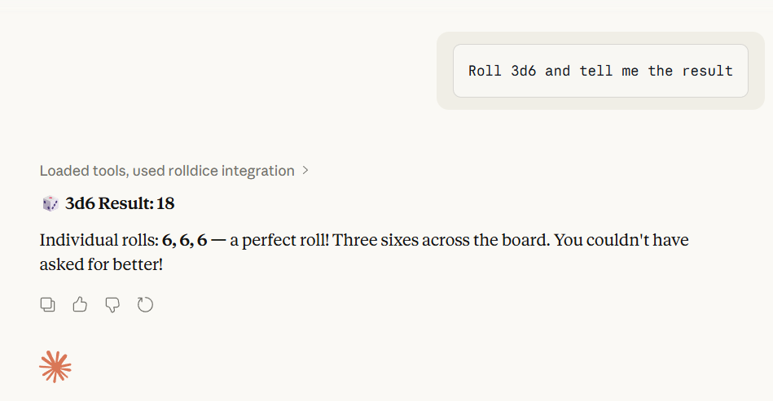
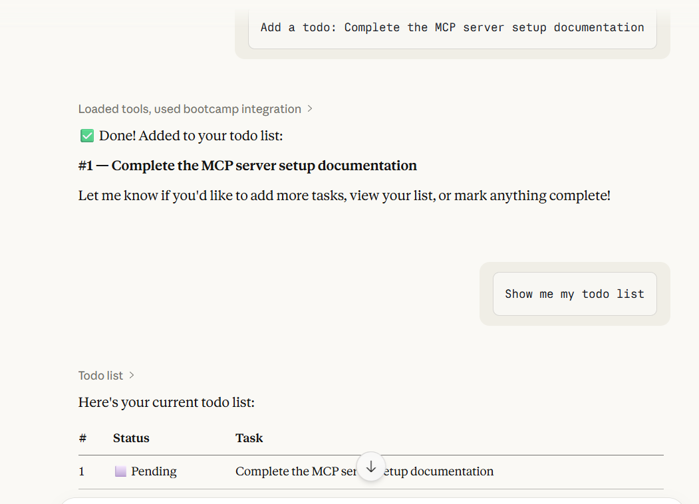
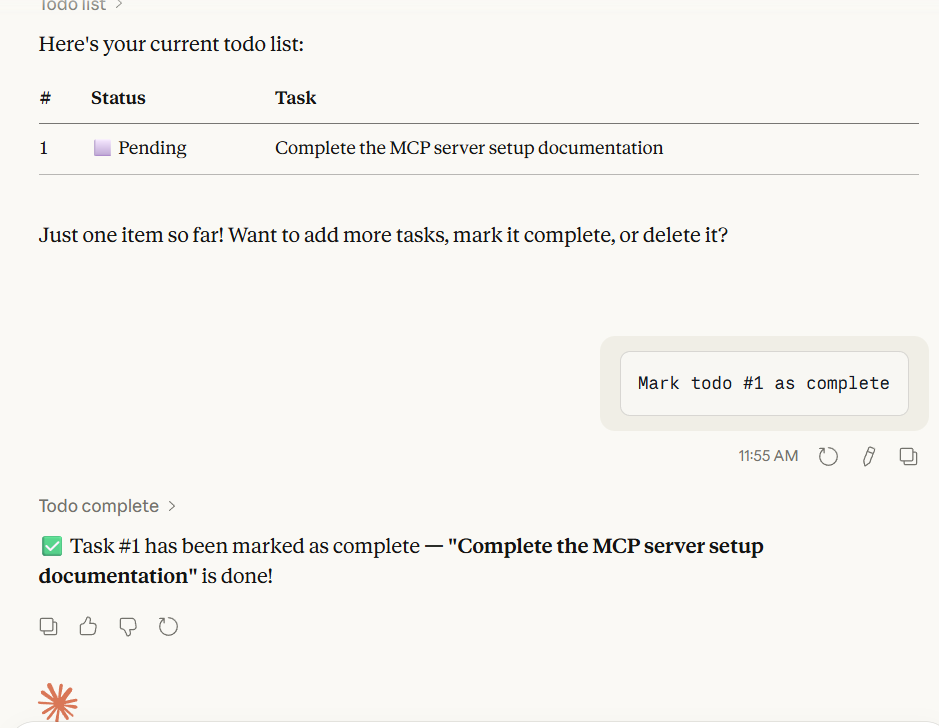
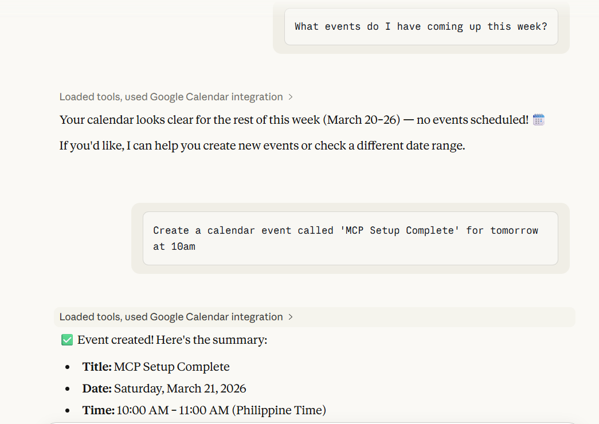
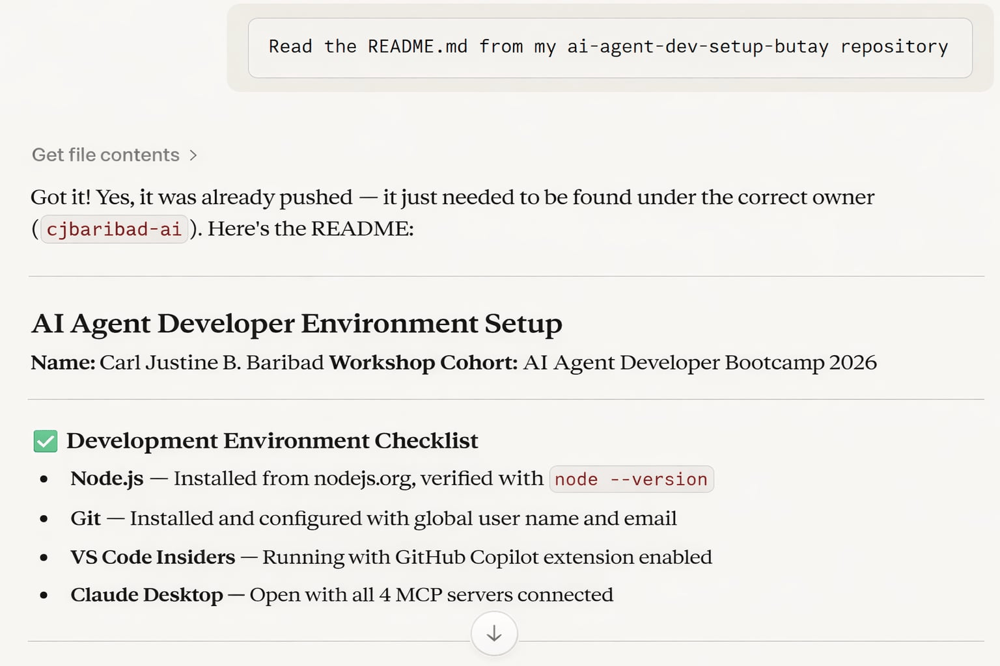
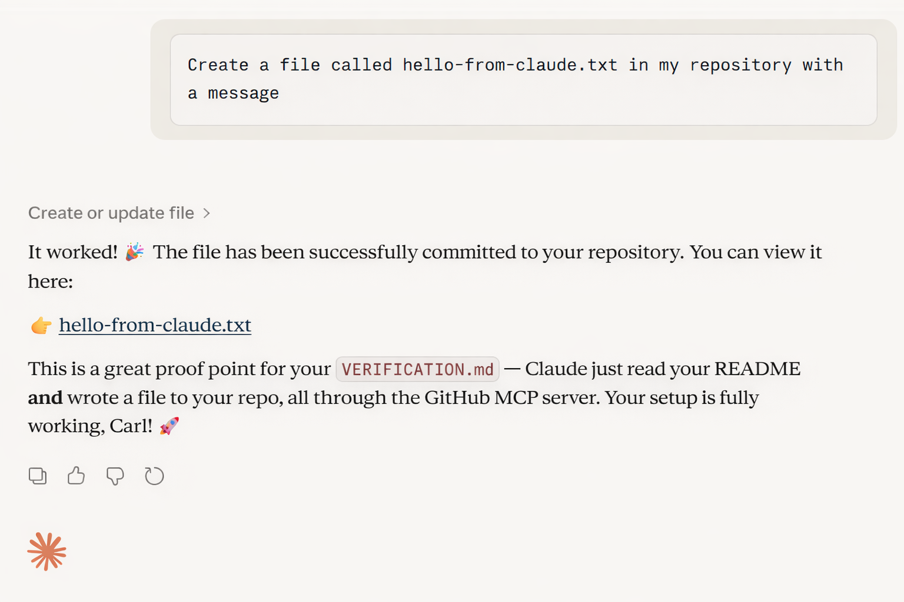
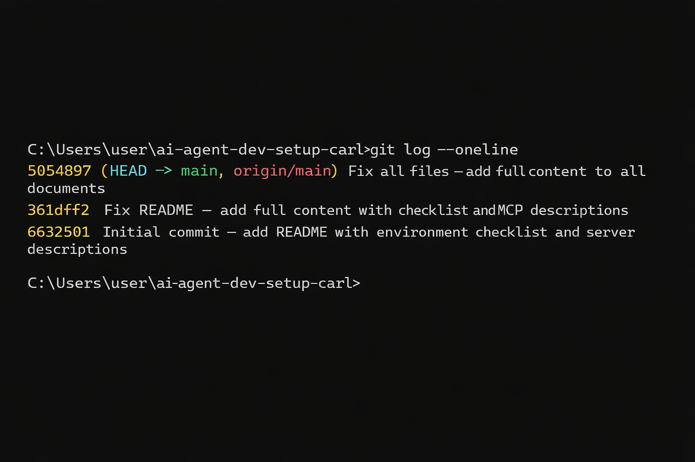

✅ VERIFICATION.md  MCP Server Proof of Functionality

Author: Carl Justine B. Baribad
Date: April 2026
Cohort: AI Agent Developer Bootcamp 2026

This document provides evidence that all 4 MCP servers are connected and functioning correctly within Claude Desktop.

---

1. 🎲 Rolldice MCP Server — Verified Working

Test performed: Asked Claude to roll dice using standard notation.

Prompt used:
> "Roll 3d6 and tell me the result"

Screenshot:

Evidence of tool invocation: The Claude Desktop interface shows the tool call expanding with the dice notation parameter, and a numeric result returned by the server not generated by Claude's language model.

---

2. 🧠 Bootcamp AI Agent MCP Server  Verified Working

Test performed: Added a todo item, listed todos, and completed the task.

Prompts used:
> "Add a todo: Complete the MCP server setup documentation"
> "Show me my todo list"
> "Mark todo #1 as complete"

Screenshot:

Evidence of tool invocation: Each operation shows a distinct tool call in the Claude Desktop interface, demonstrating that Claude is delegating to the server rather than computing internally.

---

3. 📅 Google Calendar MCP Server Verified Working

Test performed: Listed upcoming calendar events and created a test event.

Prompts used:
> "What events do I have coming up this week?"
> "Create a calendar event called 'MCP Setup Complete' for tomorrow at 10am"

Screenshot:

Evidence of tool invocation: The response includes real calendar data from your Google Calendar, and the created event appears in Google Calendar when verified directly.

---

4. 🐙 GitHub MCP Server — Verified Working

Test performed: Used Claude to interact with this repository directly.

Prompts used:
> "Read the README.md from my ai-agent-dev-setup-butay repository"
> "Create a file called hello-from-claude.txt in my repository with a message"

Screenshot:

Evidence of tool invocation: The file `hello-from-claude.txt` appears in your repository after Claude creates it — verifiable directly on GitHub.com.

---

📊 Git Commit History

---

🔗 Verification Summary

| MCP Server | Connected | Tool Tested | Screenshot |
|---|---|---|---|
| Rolldice | ✅ | `roll_dice` | See above |
| Bootcamp AI Agent | ✅ | `todo_add`, `calculate` | See above |
| Google Calendar | ✅ | `gcal_list_events`, `gcal_create_event` | See above |
| GitHub | ✅ | File read + file create | See above |

All 4 servers verified as of March 2026.