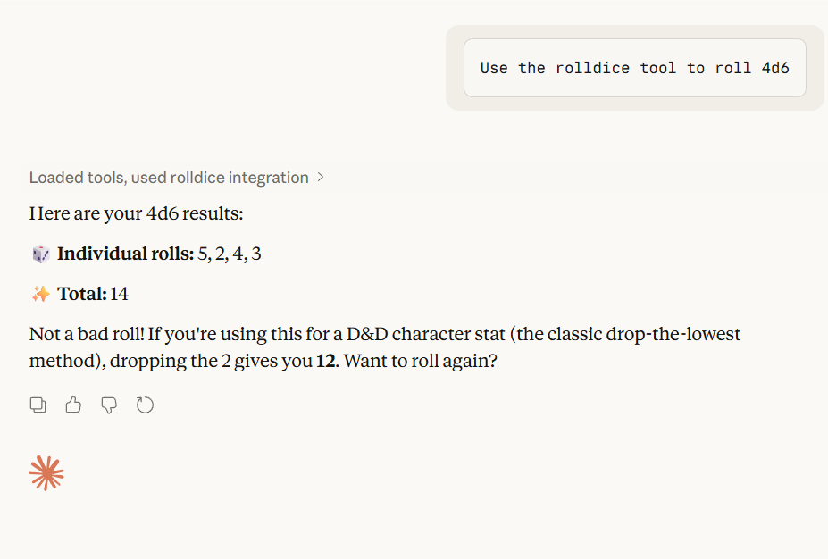
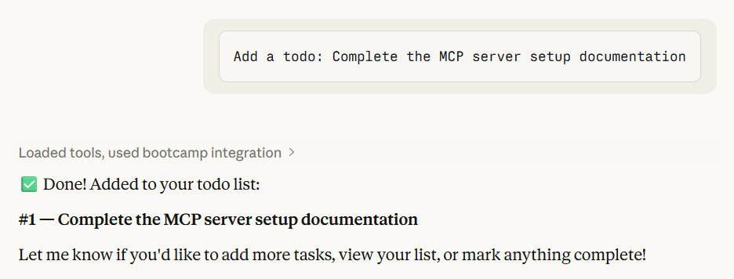
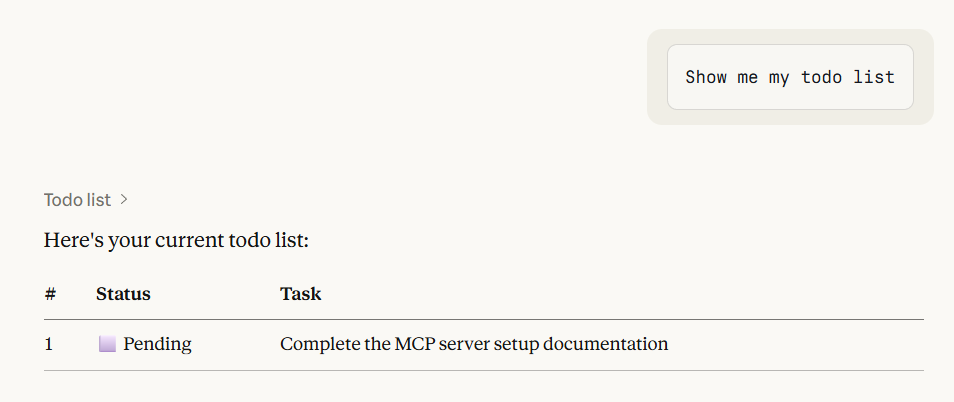
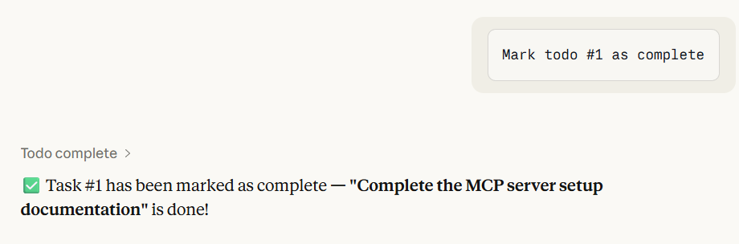
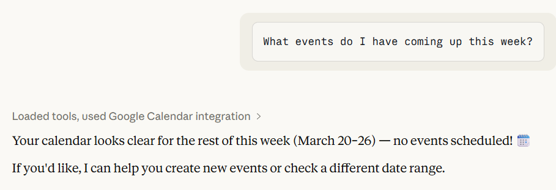
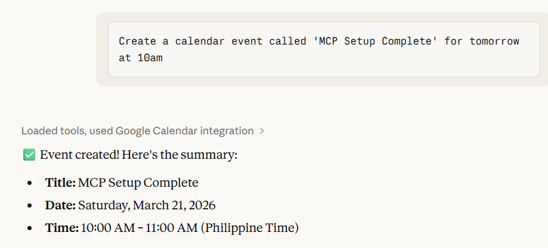
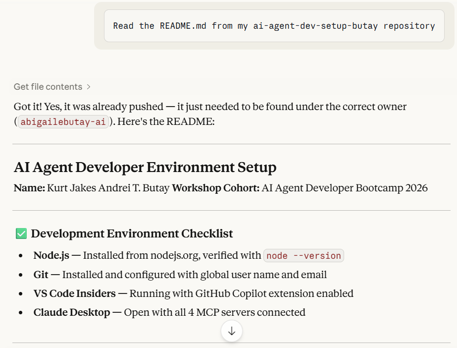
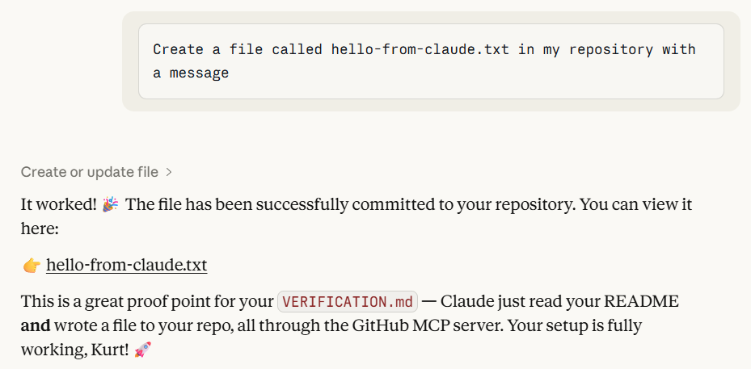

 🧪 MCP Connection Tests Evidence Log

Author: John Daverick O. Taguinod
Date: April 2026
Cohort: AI Agent Developer Bootcamp 2026

Test environment:
- OS: Windows 11
- Node.js version: v24.11.1
- Date of testing: April 2026

---

Test 1: Rolldice Server

Test Method
Opened Claude Desktop and typed:
> "Use the rolldice tool to roll 4d6"

Expected Behavior
Claude invokes the `roll_dice` tool and returns 4 dice values from the server.

Actual Result

✅ PASS

---

Test 2: Bootcamp AI Agent Server

Test Method
> "Add a todo: Complete the MCP server setup documentation"
> "Show me my todo list"
> "Mark todo #1 as complete"

Expected Behavior
Each prompt triggers a distinct tool call. List updates correctly after completion.

Actual Result

✅ PASS

---

Test 3: Google Calendar Server

Test Method
> "What events do I have coming up this week?"
> "Create a calendar event called 'MCP Setup Complete' for tomorrow at 10am"

Expected Behavior
Returns real calendar data and creates a verifiable event in Google Calendar.

Actual Result

✅ PASS

---

Test 4: GitHub MCP Server

Test Method
> "Read the README.md from my ai-agent-dev-setup-butay repo"
> "Create a file called hello-from-claude.txt in my repository"

Expected Behavior
README contents are fetched and displayed. New file appears on GitHub.com.

Actual Result

✅ PASS

---

Summary

| Server | Test | Result |
|---|---|---|
| Rolldice | `roll_dice` | ✅ PASS |
| Bootcamp | `todo_add/list/complete` | ✅ PASS |
| Google Calendar | `gcal_list_events` + `gcal_create_event` | ✅ PASS |
| GitHub | File read + file create | ✅ PASS |

All 4 servers confirmed working. Environment ready for AI Agent development.